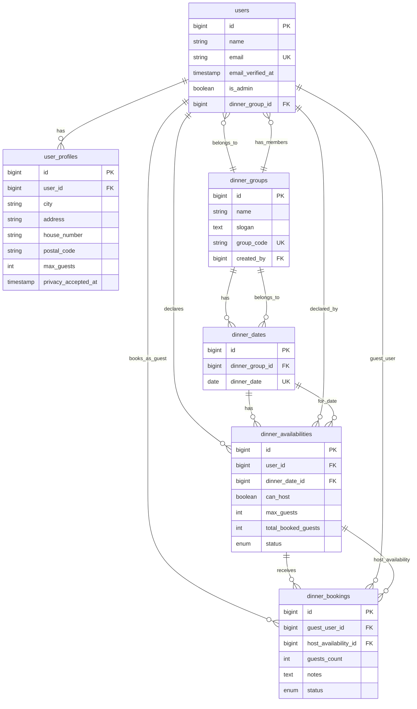
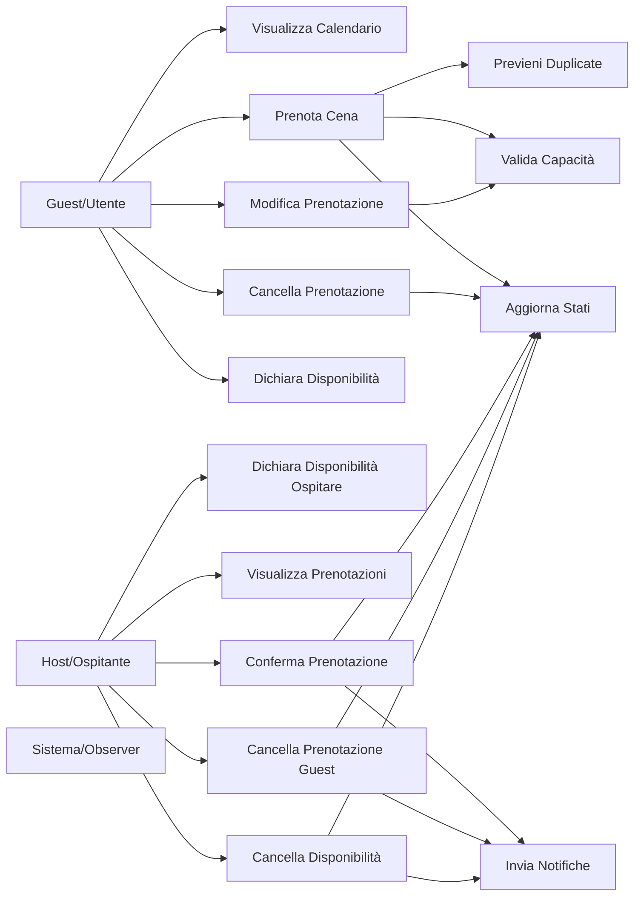
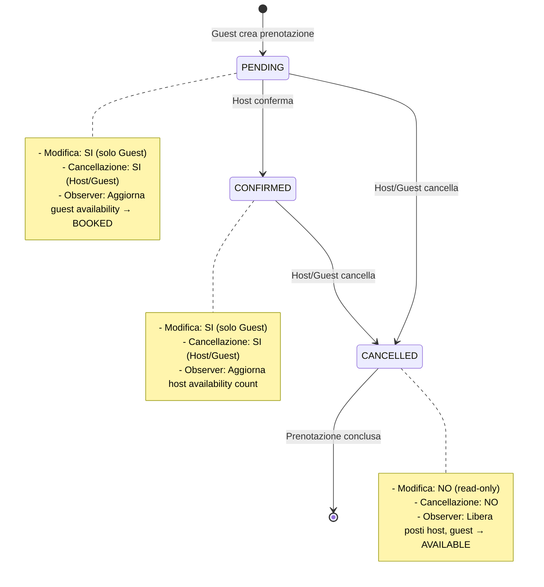
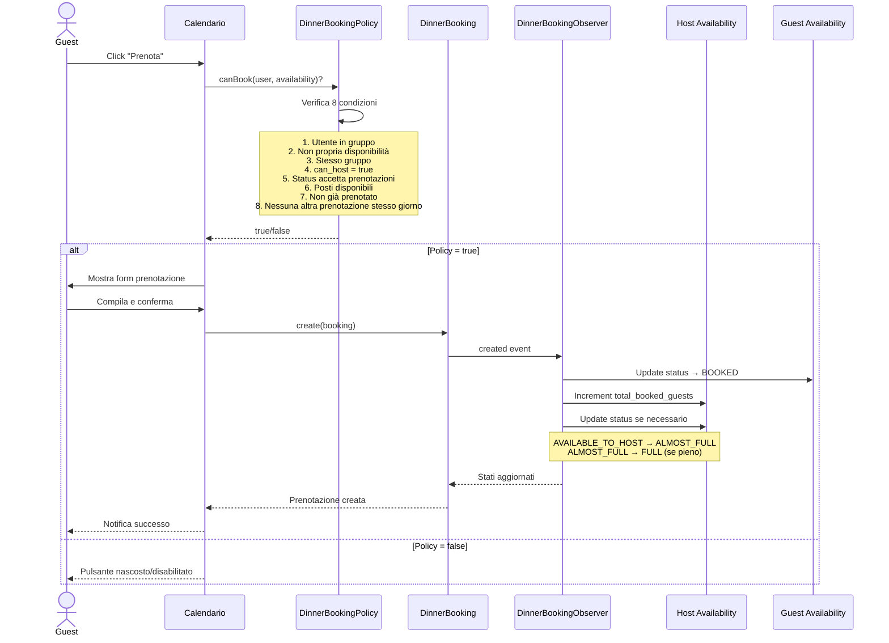

# Piano Implementazione Sistema Prenotazioni Cene

## Concetti Chiave

### Ruoli e Responsabilità

**HOST (chi cucina/ospita)**:
- Crea una **DinnerAvailability** con `can_host = true`
- Dichiara: "Sono disponibile ad ospitare il giorno X, posso ospitare Y persone"
- La disponibilità ha stati: `AVAILABLE_TO_HOST` → `ALMOST_FULL` → `FULL` → `HOST_CANCELLED`
- Gestisce le prenotazioni ricevute (conferma/cancella)

**GUEST (chi partecipa/mangia)**:
- Può creare una **DinnerAvailability** con `can_host = false` per dichiarare la propria disponibilità
  - Stati disponibilità guest: `AVAILABLE` (disponibile) o `NOT_AVAILABLE` (non disponibile)
  - Serve per comunicare al gruppo la propria presenza/assenza
- Crea un **DinnerBooking** prenotando la disponibilità di un host
- Dichiara: "Voglio partecipare alla cena di [host] il giorno X"
- La prenotazione ha stati: `PENDING` → `CONFIRMED` → `CANCELLED`
- Può modificare o cancellare la propria prenotazione

### Flusso Principale

1. **Host dichiara disponibilità**: Crea `DinnerAvailability` con `can_host=true` per una data specifica
2. **Guest vede nel calendario**: La disponibilità dell'host appare nel calendario del gruppo
3. **Guest prenota**: Crea `DinnerBooking` collegato alla `DinnerAvailability` dell'host
4. **Observer aggiorna automaticamente**:
   - La `DinnerAvailability` del guest passa a `BOOKED` (non può prenotare altre cene quel giorno)
   - La `DinnerAvailability` dell'host incrementa `total_booked_guests`
   - Lo stato dell'host si aggiorna automaticamente: `AVAILABLE_TO_HOST` → `ALMOST_FULL` → `FULL`

### Note Aggiuntive

- Un utente può creare `DinnerAvailability` con `can_host = false` per dichiarare disponibilità come guest
  - Stati: `AVAILABLE` (sono disponibile), `NOT_AVAILABLE` (non sono disponibile)
  - Serve per comunicare al gruppo presenza/assenza senza creare posti
- Un utente **non può** prenotare la propria disponibilità (non può essere host e guest della stessa cena)
- Un utente può avere **solo una prenotazione** (confermata/pending/cancellata) per giorno
- Le prenotazioni `CANCELLED` sono **read-only** (non modificabili né eliminabili)

### Gestione Cancellazione

**Cancellazione Disponibilità (HOST)**:
- **Senza prenotazioni**: L'host può **eliminare completamente** la propria `DinnerAvailability`
- **Con prenotazioni**: L'host **non può eliminare** ma solo cambiare lo stato a `HOST_CANCELLED`
  - Le prenotazioni esistenti rimangono visibili
  - I guest vengono notificati della cancellazione
  - La disponibilità non accetta più nuove prenotazioni

**Cancellazione Prenotazione (GUEST)**:
- Il guest **non può eliminare** la prenotazione (no hard delete)
- Può solo cambiare lo stato a `CANCELLED` (soft cancellation)
  - La prenotazione rimane nel database per storico
  - L'host viene notificato della cancellazione
  - I posti vengono liberati e tornano disponibili
  - La prenotazione diventa **read-only** (non più modificabile)

---

## Schema Database - Tabelle e Relazioni



## Diagramma UML - Casi d'Uso Sistema Prenotazioni



## Diagramma Stati - DinnerBooking



## Diagramma Sequenza - Creazione Prenotazione



## Obiettivo
Implementare un sistema di prenotazioni che permetta agli utenti di prenotare cene quando altri membri del gruppo si offrono come host (can_host=true). Il sistema deve gestire la capacità massima di ospiti e cambiare automaticamente lo stato dell'host a BOOKED quando necessario.

## PREREQUISITI - Revisione DinnerAvailabilityStatus

### Nuova Struttura Enum

**Per `can_host = true` (chi ospita):**
1. `AVAILABLE_TO_HOST` - "Disponibile ad ospitare" (verde) - nessuna prenotazione ancora
2. `ALMOST_FULL` - "Quasi pieno" (arancione/warning) - ha prenotazioni ma ci sono ancora posti ( almeno un posto confermato )
3. `FULL` - "Pieno" (rosso scuro) - tutti i posti occupati, non accetta più prenotazioni
4. `HOST_CANCELLED` - "Annullato" (grigio) - l'host ha cancellato la disponibilità

**Per `can_host = false` (chi partecipa):**
1. `AVAILABLE` - "Disponibile" (verde chiaro) - disponibile a partecipare
2. `BOOKED` - "Prenotato" (viola) - ha prenotato una cena come guest
3. `UNAVAILABLE` - "Non disponibile" (rosso) - non può partecipare

### Diagramma Cambi di Stato

**Per HOST (can_host = true):**
```
AVAILABLE_TO_HOST
    ↓ (prima prenotazione arriva)
ALMOST_FULL
    ↓ (posti si esauriscono completamente)
FULL
    ↑ (prenotazioni cancellate, tornano posti disponibili)
ALMOST_FULL
    ↑ (tutte le prenotazioni cancellate)
AVAILABLE_TO_HOST

AVAILABLE_TO_HOST / ALMOST_FULL / FULL
    ↓ (host cancella manualmente)
HOST_CANCELLED
```

**Per GUEST (can_host = false):**
```
AVAILABLE
    ↓ (prenota una cena da qualcuno)
BOOKED
    ↑ (cancella la prenotazione)
AVAILABLE

AVAILABLE
    ↓ (decide di non unirsi a nessuna cena)
UNAVAILABLE
    ↑ (cambia idea)
AVAILABLE
```

### Regole di Transizione

**Automatiche (gestite da Observer):**
- `AVAILABLE_TO_HOST` → `ALMOST_FULL` quando arriva la prima prenotazione
- `ALMOST_FULL` → `FULL` quando `total_booked_guests >= max_guests`
- `FULL` → `ALMOST_FULL` quando `total_booked_guests < max_guests` (dopo cancellazione)
- `ALMOST_FULL` → `AVAILABLE_TO_HOST` quando `total_booked_guests = 0` (tutte cancellate)
- `AVAILABLE` → `BOOKED` quando guest crea una prenotazione
- `BOOKED` → `AVAILABLE` quando guest cancella la prenotazione

**Manuali (utente sceglie):**
- `AVAILABLE_TO_HOST/ALMOST_FULL/FULL` → `HOST_CANCELLED` (host cancella)
- `AVAILABLE` ↔ `UNAVAILABLE` (guest cambia disponibilità)
- `AVAILABLE` ↔ `MAYBE` (guest non è sicuro)

## Requisiti Principali
1. **Pulsante "Prenota"** visibile solo su disponibilità con:
   - `can_host = true`
   - `status = AVAILABLE_TO_HOST` o `status = ALMOST_FULL` (non FULL o HOST_CANCELLED)
   - Posti disponibili dall'host (`available_spots > 0`)
   - Non è la propria disponibilità
   - Guest non ha già altre prenotazioni confermate nello stesso giorno

2. **Tabella `dinner_bookings`** con campi:
   - `guests_count` (numero ospiti aggiuntivi portati)
   - `bringing_items` (cosa porta il guest)
   - `notes` (note/allergie)
   - Relazioni con disponibilità host e guest

3. **Validazione capacità**: Impedire prenotazione se `guests_count + prenotazioni_esistenti > max_guests` dell'host

4. **Cambio stato automatico**:
   - HOST: `AVAILABLE_TO_HOST` → `ALMOST_FULL` (prima prenotazione) → `FULL` (posti esauriti)
   - GUEST: `AVAILABLE` → `BOOKED` (quando prenota) → `AVAILABLE` (quando cancella)

## Struttura Dati

### Tabella `dinner_bookings`
```
- id
- host_availability_id (FK -> dinner_availabilities)
- guest_user_id (FK -> users)
- guests_count (int: ospiti aggiuntivi oltre al guest)
- bringing_items (text nullable)
- notes (text nullable)
- status (enum: confirmed/cancelled)
- timestamps
- UNIQUE(host_availability_id, guest_user_id)
```

**IMPORTANTE:** Un utente NON può avere più prenotazioni come ospite nello stesso giorno. Questo vincolo deve essere implementato a livello di validazione/policy.


### Relazioni
- DinnerBooking → DinnerAvailability (host)
- DinnerBooking → User (guest)
- DinnerAvailability → hasMany DinnerBooking
- User → hasMany DinnerBooking (come guest ma non nello stesso giorno)

## Implementazione Step-by-Step

### ✅ STEP 0: Aggiornamento Enum DinnerAvailabilityStatus (COMPLETATO)
**File modificati:**
1. ✅ `app/Enums/DinnerAvailabilityStatus.php` - aggiornato con nuovi stati:
   - ✅ Aggiunti: `AVAILABLE_TO_HOST`, `ALMOST_FULL`, `FULL`, `HOST_CANCELLED`
   - ✅ Mantenuti: `AVAILABLE`, `BOOKED`, `UNAVAILABLE`
   - ✅ Rimosso: `CANCELLED` (sostituito da `HOST_CANCELLED`) e `MAYBE`
   - ✅ Aggiornati labels, colors, icons per tutti gli stati
   - ✅ Aggiunti metodi helper: `isHostStatus()`, `isGuestStatus()`, `canAcceptBookings()`

2. ✅ `database/seeders/DinnerDatesSeeder.php` - aggiornato per usare i nuovi stati
   - ✅ HOST: solo `AVAILABLE_TO_HOST` come stato iniziale
   - ✅ GUEST: 85% `AVAILABLE`, 15% `UNAVAILABLE`
   - ✅ Stati automatici (ALMOST_FULL, FULL, BOOKED) gestiti dall'Observer
   - ✅ max_guests random tra 4-10 per host

**Risultato:**
- ✅ Enum con 7 stati separati per host (4) e guest (3)
- ✅ Transizioni automatiche gestibili da Observer
- ✅ Seeder aggiornato per generare solo stati iniziali validi
- ✅ Colore personalizzato `purple` aggiunto al panel Filament

### ✅ STEP 1: Database e Modelli Base (COMPLETATO)
**File creati:**
1. ✅ `database/migrations/2025_12_21_161343_create_dinner_bookings_table.php` - migrata con successo
2. ✅ `database/migrations/2025_12_21_162346_add_max_guests_to_dinner_availabilities_table.php` - migrata con successo
3. ✅ `app/Models/DinnerBooking.php` - con relazioni e scopes

**File modificati:**
4. ✅ `app/Models/DinnerAvailability.php` - aggiunta relazione `bookings()` e metodi helper:
   - `confirmedBookings()`
   - `getTotalBookedGuestsAttribute()`
   - `hasAvailableSpots()`
   - `getAvailableSpotsAttribute()`
   - ✅ `canAcceptBookings()` - verifica se status = AVAILABLE_TO_HOST o ALMOST_FULL
   - ✅ Aggiunto campo `max_guests` a fillable e casts

5. ✅ `app/Models/User.php` - aggiunta relazione `guestBookings()`

6. ✅ `app/Filament/App/Resources/DinnerAvailabilities/Schemas/DinnerAvailabilityForm.php`:
   - ✅ Filtro dinamico stati in base a can_host (usa `isHostStatus()` e `isGuestStatus()`)
   - ✅ Campo `max_guests` visibile solo per host con `->dehydrated()`
   - ✅ Default `max_guests` dal profilo utente
   - ✅ Cambio automatico status quando si toglie/mette can_host

7. ✅ `app/Providers/Filament/AppPanelProvider.php` - aggiunto colore custom `purple`

**Risultato:**
- ✅ Tabella `dinner_bookings` creata con tutti i campi e constraints
- ✅ Tabella `dinner_availabilities` estesa con campo `max_guests`
- ✅ Modello DinnerBooking con relazioni hostAvailability e guest
- ✅ Modello DinnerAvailability con metodi helper per calcolare posti disponibili
- ✅ Aggiornato `booted()` per validare coerenza tra can_host e status
- ✅ User model con relazione alle prenotazioni come guest
- ✅ Form con state machine semplice per gestione stati
- ✅ Colore purple disponibile in Filament

### ✅ STEP 2: Business Logic e Validazioni (COMPLETATO)
**File creati:**
1. ✅ `app/Rules/ValidateBookingCapacity.php` - validazione capacità con supporto per edit
2. ✅ `app/Observers/DinnerBookingObserver.php` - gestisce transizioni automatiche status:
   - ✅ HOST: AVAILABLE_TO_HOST → ALMOST_FULL → FULL (e viceversa)
   - ✅ GUEST: AVAILABLE → BOOKED (e viceversa)
   - ✅ Gestisce eventi: created, updated, deleted
   - ✅ Usa `saveQuietly()` per evitare loop infiniti
3. ✅ `app/Enums/DinnerBookingStatus.php` - enum per stati prenotazioni (PENDING, CONFIRMED, CANCELLED)

**Commit creato:** d87c4b4 - "feat: implementato sistema prenotazioni cene con gestione stati"

**Risultato:**
- ✅ ValidateBookingCapacity verifica posti disponibili considerando guests_count + 1
- ✅ Observer gestisce automaticamente tutti i cambi di stato
- ✅ Non modifica status HOST_CANCELLED (manuale)
- ✅ Enum DinnerBookingStatus creato per stati prenotazioni

### ✅ STEP 3: Registrazione Observer e Autorizzazioni (COMPLETATO)
**File modificati:**
1. ✅ `app/Providers/AppServiceProvider.php` - registrato DinnerBookingObserver nella boot()
2. ✅ `app/Policies/DinnerBookingPolicy.php` - policy completa per bookings con metodo `book()`
   - Verifica tutte le condizioni: stesso gruppo, non propria disponibilità, can_host=true
   - Controlla status (AVAILABLE_TO_HOST o ALMOST_FULL)
   - Verifica posti disponibili e prenotazioni duplicate
   - **AGGIORNATO (27/12/2025)**: Impedisce prenotazioni multiple nello stesso giorno includendo ANCHE prenotazioni CANCELLED
   - Blocca prenotazioni se esiste già una prenotazione per lo stesso giorno (stati: confirmed, pending, cancelled)
3. ✅ `app/Policies/DinnerAvailabilityPolicy.php` - aggiornato metodo `delete()` per impedire cancellazione con prenotazioni confermate

**Cosa fa:**
- Definisce chi può vedere/creare/modificare/cancellare prenotazioni
- Metodo speciale `book()` verifica tutte le condizioni per prenotare:
  - Non è la propria disponibilità
  - Stesso gruppo
  - can_host = true
  - status = `AVAILABLE_TO_HOST` o `ALMOST_FULL` (non FULL o HOST_CANCELLED)
  - Ci sono posti disponibili (`available_spots > 0`)
  - Non ha già prenotato questa disponibilità (qualsiasi stato: confirmed/pending/cancelled)
  - **Non ha altre prenotazioni nello stesso giorno (incluse quelle cancellate)**
- Impedisce cancellazione disponibilità con prenotazioni attive

### ✅ STEP 4: Interfaccia Calendario e Form Prenotazione (COMPLETATO)
**File modificati:**
1. ✅ `app/Filament/App/Pages/GroupAvailabilities.php`:
   - ✅ Aggiunte proprietà `$bookingAvailabilityId` e `$bookingData`
   - ✅ Implementato metodo `canBook()` che usa la policy
   - ✅ Implementato metodo `openBookingModal()`
   - ✅ Creato Action `createBooking()` con form completo:
     - Campo `guests_count` con validazione capacità
     - Campo `total_guests_display` che mostra il totale in tempo reale
     - Campo `bringing_items` come TagsInput
     - Campo `notes` per allergie e note
   - ✅ Aggiornato `loadCalendarData()` per includere info prenotazioni (max_guests, available_spots, total_booked, can_book)
   - ✅ **AGGIORNATO (27/12/2025)**: Aggiunto recupero `user_booking` per ogni giorno con id, status e host_name
   - ✅ **Documentazione PHPDoc completa** per classe e tutti i metodi
   - ✅ Gestione creazione prenotazione con notifiche success/error
   - ✅ Ricaricamento automatico calendario dopo prenotazione
   - ✅ Semplificati controlli duplicati (gestiti dalla Policy)

2. ✅ `resources/views/filament/app/pages/group-availabilities.blade.php`:
   - ✅ Aggiunto pulsante "Prenota" visibile solo se `can_book = true`
   - ✅ Mostra info posti disponibili per host: "Posti: X/Y (Z liberi)" o "(PIENO)"
   - ✅ Badge colorati per host (verde) e guest (rosa)
   - ✅ Modal gestito tramite Filament Action
   - ✅ Aggiornati filtri con nuovi stati (optgroup per Host e Guest)
   - ✅ **AGGIORNATO (27/12/2025)**: Aggiunto badge cliccabile per prenotazioni esistenti dell'utente
     - Badge verde per prenotazioni confermate
     - Badge arancione per prenotazioni pending
     - Badge rosso per prenotazioni cancellate
     - Link diretto alla pagina modifica prenotazione
     - Mostra nome host e status
   - ✅ Fix: giorni passati usano `<` invece di `<=` per styling

**Risultato:**
- ✅ Form prenotazione completamente funzionante
- ✅ Validazione in tempo reale della capacità
- ✅ UI migliorata con info posti e stati colorati
- ✅ Observer gestisce automaticamente i cambi di stato
- ✅ **Visualizzazione chiara prenotazioni esistenti nel calendario**
- ✅ **Prevenzione prenotazioni duplicate con feedback visivo**

## Stato Attuale

### ✅ Completato (STEP 0-4)
- ✅ Enum DinnerAvailabilityStatus aggiornato con 7 stati (incluso COMPLETED)
- ✅ Database e modelli creati (dinner_bookings, max_guests)
- ✅ Business logic implementata (ValidateBookingCapacity, DinnerBookingObserver)
- ✅ Observer registrato in AppServiceProvider
- ✅ Policy implementate (DinnerBookingPolicy, DinnerAvailabilityPolicy)
- ✅ Form prenotazione completo nel calendario
- ✅ UI calendario migliorata con posti disponibili e pulsante prenota
- ✅ Filtri aggiornati con nuovi stati
- ✅ Risorsa Filament DinnerBooking completamente creata
- ✅ Form modifica prenotazione con controllo `canUpdateBookings()`
- ✅ Badge prenotazioni esistenti nel calendario

### ✅ Correzioni Applicate (27/12/2025)

**1. Policy DinnerAvailabilityPolicy.delete() - CORRETTO**
- ✅ Ora controlla TUTTE le prenotazioni (pending, confirmed, cancelled)
- ✅ Comportamento implementato:
  - Senza prenotazioni → permette eliminazione (hard delete)
  - Con prenotazioni (qualsiasi stato) → blocca eliminazione, deve usare stato HOST_CANCELLED
- ✅ Documentazione PHPDoc aggiornata con spiegazione completa

**2. Policy DinnerBookingPolicy.delete() - CORRETTO**
- ✅ Ora restituisce sempre `false` - eliminazione fisica NON permessa
- ✅ Comportamento implementato:
  - Nessuna eliminazione fisica permessa per mantenere storico
  - Guest/Host devono cambiare stato a CANCELLED tramite form
  - Documentazione completa del flusso corretto
- ✅ PHPDoc spiega come cancellare correttamente una prenotazione

**3. EditDinnerBooking - CORRETTO**
- ✅ Rimosso DeleteAction dall'header
- ✅ Cancellazione avviene solo tramite cambio campo 'status' a CANCELLED
- ✅ Documentazione aggiornata con nuovo flusso

**4. Policy DinnerAvailabilityPolicy - Stato COMPLETED**
- ✅ `update()`: Blocca modifica di disponibilità COMPLETED
- ✅ `delete()`: Blocca eliminazione di disponibilità COMPLETED
- ✅ Disponibilità completate sono immutabili (dato storico)

**5. Policy DinnerBookingPolicy - Prenotazioni per Cene Completate**
- ✅ `update()`: Blocca modifica di prenotazioni per disponibilità COMPLETED
- ✅ Verifica `hostAvailability->status === COMPLETED`
- ✅ Prenotazioni per cene concluse sono immutabili (dato storico)

**6. Form Read-Only per Dati Storici**
- ✅ `DinnerAvailabilityResource.form()`: Disabilita form se COMPLETED o data passata
- ✅ `EditDinnerAvailability`: Nasconde azioni header e form se read-only
- ✅ `DinnerBookingResource.form()`: Disabilita form se CANCELLED, COMPLETED o data passata
- ✅ `EditDinnerBooking.isReadOnly()`: Verifica condizioni read-only complete
- ✅ Form disabilitati mostrano dati ma non permettono modifiche (user experience migliore)

**7. Pagina View per Disponibilità (27/12/2025)**
- ✅ Creata `ViewDinnerAvailability.php` per visualizzazione in sola lettura
- ✅ Registrata route `/{record}` nel DinnerAvailabilityResource
- ✅ Aggiunto ViewAction nella tabella disponibilità
- ✅ Mostra dettagli disponibilità + relation manager prenotazioni
- ✅ Utilizzabile per disponibilità COMPLETED o passate

**8. Nuovo Stato Guest NOT_AVAILABLE (27/12/2025)**
- ✅ Aggiunto stato `NOT_AVAILABLE` all'enum `DinnerAvailabilityStatus`
- ✅ Permette ai guest di dichiarare esplicitamente di non essere disponibili
- ✅ Serve per comunicare al gruppo la propria assenza per una data
- ✅ Colore grigio, icona calendario-X
- ✅ Aggiornato metodo `isGuestStatus()` per includere entrambi gli stati guest
- ✅ Filtri calendario ora generati dinamicamente dall'enum
- ✅ Actions tabella prenotazioni rispettano policy (blocco per COMPLETED)

### ⏳ Prossimi Step

### STEP 5: Gestione Transizioni di Stato Prenotazioni (IN CORSO)

**Obiettivo**: Implementare un sistema di transizioni di stato per le prenotazioni che permetta di gestire il ciclo di vita completo di una prenotazione, dalla creazione alla conferma/cancellazione.

#### Stati DinnerBooking (già esistenti)
- `PENDING` - "In attesa" (arancione) - Prenotazione creata, in attesa di conferma dall'host
- `CONFIRMED` - "Confermato" (verde) - Prenotazione confermata dall'host
- `CANCELLED` - "Cancellato" (rosso) - Prenotazione cancellata (dall'host o dal guest)

#### Diagramma Transizioni Stati Prenotazioni
```
PENDING (creazione)
    ↓ (host conferma)
CONFIRMED
    ↓ (host/guest cancella)
CANCELLED

PENDING
    ↓ (host/guest cancella)
CANCELLED
```

#### Regole di Transizione
**Automatiche (gestite da Observer - già implementato):**
- Creazione prenotazione → status = `PENDING`
- Guest crea prenotazione → guest availability status = `BOOKED`
- Host conferma prenotazione → booking status = `CONFIRMED`
- Cancellazione prenotazione → booking status = `CANCELLED`
- Cancellazione prenotazione → guest availability status torna `AVAILABLE`

**Manuali (da implementare):**
- Host può confermare prenotazioni PENDING → CONFIRMED
- Host può cancellare prenotazioni PENDING/CONFIRMED → CANCELLED
- Guest può cancellare proprie prenotazioni PENDING/CONFIRMED → CANCELLED
- **NON si può riattivare una prenotazione CANCELLED** (deve crearne una nuova)

#### File da Modificare/Creare

**1. Policy (aggiornamento):**
- ✅ `app/Policies/DinnerBookingPolicy.php` - già esiste, da aggiornare:
  - Aggiungere metodo `confirm()` - solo host può confermare
  - Aggiornare `delete()` per gestire sia host che guest
  - Verificare che cancellazioni aggiornino correttamente gli stati

**2. Observer (aggiornamento):**
- ✅ `app/Observers/DinnerBookingObserver.php` - già esiste, verificare:
  - Gestisce correttamente `updated()` quando status cambia
  - Aggiorna contatori host quando booking passa PENDING → CONFIRMED
  - Libera posti quando booking passa a CANCELLED
  - Non modifica host status se status = HOST_CANCELLED

**3. Risorsa Filament (da creare/aggiornare):**
- `app/Filament/App/Resources/DinnerBookingResource.php`
- `app/Filament/App/Resources/DinnerBookings/Pages/EditDinnerBooking.php`
  - Aggiungere **Actions** per conferma/cancellazione
  - Action "Conferma" visibile solo per host, solo su status PENDING
  - Action "Cancella" visibile per host e guest, solo su status PENDING/CONFIRMED
  - Form di modifica bloccato se status = CANCELLED

**4. Notifiche (da implementare):**
- Notifica al guest quando host conferma prenotazione
- Notifica all'host quando guest cancella prenotazione
- Notifica al guest quando host cancella prenotazione

**5. UI Calendario (aggiornamento):**
- ✅ Badge già mostra status con colori corretti
- Da valutare: mostrare action rapide nel badge (conferma/cancella)?

#### Validazioni da Implementare

1. **Conferma prenotazione**:
   - Solo host può confermare
   - Solo prenotazioni PENDING possono essere confermate
   - Verificare che ci siano ancora posti disponibili (nel caso siano stati modificati)
   - Inviare notifica al guest

2. **Cancellazione prenotazione**:
   - Host e guest possono cancellare
   - Solo PENDING/CONFIRMED possono essere cancellate
   - Liberare posti per l'host
   - Aggiornare status guest availability a AVAILABLE
   - Aggiornare status host availability se necessario (FULL → ALMOST_FULL)
   - Inviare notifica alla controparte

3. **Modifica prenotazione**:
   - Solo guest può modificare
   - Solo PENDING/CONFIRMED possono essere modificate
   - Non può modificare `guests_count` se porta il totale oltre `max_guests` dell'host
   - Se status = CANCELLED → form read-only, mostrare messaggio

#### Test Cases da Creare

- Test conferma prenotazione da parte host
- Test cancellazione da parte host
- Test cancellazione da parte guest
- Test che CANCELLED non può tornare a PENDING/CONFIRMED
- Test notifiche inviate correttamente
- Test aggiornamenti contatori posti dopo conferma/cancellazione

### STEP 7: Testing
**File da creare:**
21. `tests/Unit/Models/DinnerBookingTest.php`
22. `tests/Unit/Rules/ValidateBookingCapacityTest.php`
23. `tests/Unit/Observers/DinnerBookingObserverTest.php`
24. `tests/Feature/DinnerBooking/BookingCreationTest.php`
25. `tests/Feature/DinnerBooking/BookingPolicyTest.php`
26. `tests/Feature/DinnerBooking/BookingCapacityTest.php`
27. `tests/Feature/DinnerBooking/StatusTransitionsTest.php` - testa i cambi di stato automatici

**Cosa fa:**
- Verifica funzionamento modelli e relazioni
- Testa validazioni e business logic
- Verifica autorizzazioni e edge cases

## File Critici

### Da Modificare PRIMA (Priorità Massima - STEP 0)
1. `app/Enums/DinnerAvailabilityStatus.php` - aggiornare enum con nuovi stati

### Da Creare (Priorità Alta)
1. `database/migrations/*_create_dinner_bookings_table.php`
2. `app/Models/DinnerBooking.php`
3. `app/Rules/ValidateBookingCapacity.php`
4. `app/Observers/DinnerBookingObserver.php`
5. `app/Policies/DinnerBookingPolicy.php`

### Da Modificare (Priorità Alta)
1. `app/Models/DinnerAvailability.php` - relazioni e metodi helper
2. `app/Filament/App/Pages/GroupAvailabilities.php` - logica prenotazione
3. `resources/views/filament/app/pages/group-availabilities.blade.php` - UI pulsante e modal
4. `app/Providers/AppServiceProvider.php` - registrare observer
5. `app/Policies/DinnerAvailabilityPolicy.php` - proteggere delete

### Opzionali (Da Implementare Successivamente)
- Risorsa Filament completa per gestione bookings
- Notifiche email quando si riceve/cancella prenotazione
- Dashboard con statistiche prenotazioni
- Export/report per host

## Edge Cases Gestiti

1. **Capacità superata**: Validazione impedisce prenotazione
2. **Prenotazione duplicata**: Constraint UNIQUE impedisce doppie prenotazioni
3. **Cancellazione host**: Policy impedisce se ci sono prenotazioni attive
4. **Cambi status automatici**:
   - HOST: AVAILABLE_TO_HOST → ALMOST_FULL → FULL (e viceversa)
   - GUEST: AVAILABLE → BOOKED (e viceversa)
5. **Stesso gruppo**: Policy verifica appartenenza al gruppo
6. **Non propria disponibilità**: Policy impedisce prenotare se stessi
7. **Una prenotazione al giorno per guest**:
   - Policy impedisce prenotazioni multiple nello stesso giorno
   - **Include anche prenotazioni CANCELLED** (aggiornato 27/12/2025)
   - UI mostra badge con stato prenotazione esistente
   - Link diretto alla prenotazione per gestirla
8. **Stati validi per prenotazione**: Pulsante "Prenota" visibile solo per AVAILABLE_TO_HOST o ALMOST_FULL (non FULL/HOST_CANCELLED)
9. **Prenotazioni cancellate**:
   - Policy blocca nuove prenotazioni se esiste una cancellata per lo stesso giorno
   - Badge rosso nel calendario indica prenotazione cancellata
   - Messaggio chiaro all'utente sul motivo del blocco

## Note Implementative

- **Observer quietSave**: Usare `saveQuietly()` per evitare loop di eventi
- **Total guests**: `guests_count + 1` (il guest stesso conta)
- **Filtri calendario**: Mantenere funzionanti con nuove info prenotazioni
- **Modal Livewire**: Usare eventi browser per aprire/chiudere
- **Validazione real-time**: Form valida capacità durante digitazione

## Prossimi Step dopo Implementazione

1. Sistema notifiche email
2. Dashboard statistiche host/guest
3. Calendario iCal export
4. Sistema feedback post-cena
5. Chat/messaggi tra host e guests
